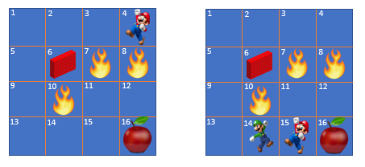

.. Copyright 2018/2019 The RLgraph authors. All Rights Reserved.
   Licensed under the Apache License, Version 2.0 (the "License");
   you may not use this file except in compliance with the License.
   You may obtain a copy of the License at
   http://www.apache.org/licenses/LICENSE-2.0
   Unless required by applicable law or agreed to in writing, software
   distributed under the License is distributed on an "AS IS" BASIS,
   WITHOUT WARRANTIES OR CONDITIONS OF ANY KIND, either express or implied.
   See the License for the specific language governing permissions and
   limitations under the License.
   ============================================================================

.. image:: images/rlcore-logo-full.png
   :scale: 25%
   :alt:

RLgraph Agents
==============

What is an Agent?
-----------------

As we have learnt already in the `chapter on environments <environments.html>`_, the agent in a reinforcement learning
problem is the part of our setup that chooses actions (from a usually fixed set of available ones) at every
time step and then observes the effects of these actions on the environment via the next state observation.

In the classic RL approach, there is only one agent in the environment, which is either some sort of "character" moving
around in a virtual world, but can also be a body-less interactor with the environment (e.g. a network traffic
optimizing agent, a chatbot agent, etc..).

We are planning, however, to integrate as well multi-agent problems into RLgraph in the near future. In those
setups, multiple agents find themselves together in the same environment (at the same time) and interact with that
environment either in a friendly, a cooperative, or even an adversarial fashion.
If you would like to contribute to that effort (e.g. by implementing a multi-agent algorithm in RLgraph), check
out our `contrib policies here <https://github.com/rlgraph/rlgraph/blob/master/contrib/README.md>`_. We will be
very happy to receive your PRs.

   **Left:** One single agent (the guy on field 4) in a grid-world environment.
   **Right:** Two (certainly non-adversarial) agents in the same environment at the same time, each one making
   their own observations, picking their own actions and receiving their own rewards.

The Agent Base Class
--------------------

In RLgraph, an Agent is the owner of the outermost component, the "root" component. Note that in the future,
an RLgraph agent will be able to hold more than one root component. The agent interacts with the root(s)
via their API-methods, not the API-methods of any children of the root. Note that the agent itself is not a component
itself.

An agent also holds important graph-building and execution tools, such as an RLgraph `GraphBuilder` instance, and an
RLgraph `GraphExecutor` instance. The `GraphBuilder` serves to build the graph at agent initiation (ctor) time and
the `GraphExecutor` takes care of live execution calls during the actual exploration and learning process.

.. figure:: images/generic-agent.png
   :alt: A generic RLgraph Agent (1), owning a root component (3) and exposing two API-methods (2), `get_action` and `update`, which internally call the root component's API-methods.

   A generic RLgraph Agent (1), owning a root component (3) and exposing two API-methods (2), `get_action` and
   `update`, which internally call the root component's API-methods. Note that the agent itself is not(!) an RLgraph
   component.

A basic RLgraph agent is usually responsible for the following tasks (only two of which are shown in the figure above):

- Build the static (or define-by-run) computation graph prior to doing any exploration/learning in the environment.

- Preprocessing the state observation signal (e.g. gray scaling an input image, splitting a text string, etc..).

- Picking an action based on the observed state. This is usually done by a forward pass through some neural
  network representing the policy, a Q-function, or something similar.

- (Optional): Storing the environment interaction history somewhere. For example, a DQN-Agent will store all
  observed states, the chosen actions, the observed rewards, and the is-terminal flags of the states in
  a so called replay memory. This functionality of the agent is referred to as "observing".

- Learn from all (or all "observed") past experiences (see bullet-point above) and update the policy weights, the model
  of the environment, or anything else that the agent (or the RL algo) deems necessary in order to optimize future
  accumulated rewards.

RLgraph's Agent Interface
-------------------------

In the following, we will walk through all the above functionalities.
For a complete overview of all of the Agent class' API-methods, take a look at its
`reference documentation here <reference/agents/>`_.
`In the next chapter <how_to_build_an_algorithm_with_rlgraph.html>`_, we will then dive deeper into agents and
their features, when we will actually build one ourselves in RLgraph from scratch.

Build (method: `build`)
+++++++++++++++++++++++

This step get the computation graph of the agent ready for execution calls.
It must be done only once via a call to `Agent.build()`, which should happen either in the Agent's ctor or manually
prior to doing any exploration, observation, or learning tasks. This is because none of these will be possible
without a readily compiled or setup computation graph.

Preprocessing States (method: `preprocess_states`)
++++++++++++++++++++++++++++++++++++++++++++++++++

This is an optional API-method (as it can also be included in a `get_action()` call (see below).
A state, usually a numpy array and coming from the environment, is passed through the agent's preprocessing facilities
(usually a PreprocessorStack component) and returned as a numpy array holding the preprocessed state.

Act (method: `get_action`)
++++++++++++++++++++++++++

Given a state from the environment, `get_action` returns the chosen action. This is usually done by passing the state
through the agent's preprocessor and the result of that through a policy or Q-value network.
Optionally, an exploration process (e.g. noise or some other form of randomization, such as epsilon greedy
exploration) is applied on top of the network's output and returned.

Most of the time, actions are represented via an IntBox space with an upper limit (categorical int).

Observe (method: `observe`)
+++++++++++++++++++++++++++

Agents can use the `observe` method to store experiences (e.g. SARS'-tuples) from the environment and the agent's
interaction with the environment in some agent-internal memory or queue.

A common example is the `2015 DQN agent <https://www.nature.com/articles/nature14236>`_, which stores
SARS'-tuples (S=state, A=action, R=reward, S'=next state) in a replay buffer for future batch learning/update runs
through the agent's network, loss function and optimizer components.

Observe also takes care of possible python-side buffering (e.g. collect n SARS'-tuples in a python list) before
actually moving all the data into the computation graph. Note that calls to the computation graph might be
somewhat expensive (tf session calls) and via this python buffering, we considerably gain performance.

Update (method: `update`)
+++++++++++++++++++++++++

Finally, the `update` methods is used to perform an actual learning (update) step with the agent.
Different agents have different updating strategies. Some may pull a batch from a memory (a SARS'-replay buffer
or an episode ring buffer), others from some type of queue, yet others simply do step-by-step (or episode by episode)
updates.

An update is often achieved by running a batch of states through a policy (or Q-learning)
neural network, in addition to some calculation of a loss function on a) the outcome of that forward pass, b) the
actually chosen actions and c) the actually observed rewards, and then passing that loss to an optimizer component
together with a list of trainable variables to update (via e.g. error-gradient calculation) and then actually
updating the values of these variables.

