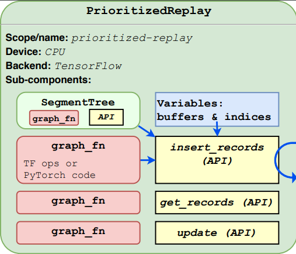

.. Copyright 2018 The RLgraph authors. All Rights Reserved.
   Licensed under the Apache License, Version 2.0 (the "License");
   you may not use this file except in compliance with the License.
   You may obtain a copy of the License at
   http://www.apache.org/licenses/LICENSE-2.0
   Unless required by applicable law or agreed to in writing, software
   distributed under the License is distributed on an "AS IS" BASIS,
   WITHOUT WARRANTIES OR CONDITIONS OF ANY KIND, either express or implied.
   See the License for the specific language governing permissions and
   limitations under the License.
   ============================================================================

.. image:: images/rlcore-logo-full.png
   :scale: 25%
   :alt:

What is an RLgraph Component?
=============================

Components are the basic building blocks, which you will use to build any machine learning and reinforcement learning
models with. A component is the smallest unit, which can be run and tested in and by itself via RLgraph's different
executor and testing classes. RLgraph components span from simple (and single) neural network layers to highly complex
policy networks, memories, optimizers and mathematical components, such as loss functions.

Each component contains:

- ... any number of sub-components, each of which may again contain their own sub-components (also sometimes
  called "child components"). Hence components are arbitrarily nestable inside each other.

- ... at least one API-method, so that clients of the component (in the end this will be our reinforcement learning agent)
  can use it.

   Above: A PrioritizedReplay example component with one child component, 3 API-methods, 3 graph functions and variables.

- ... any number of so called "Graph Functions", which are special component methods, which contain the actual
  computation code. These are the only places, where you will find backend (tensorflow, pytorch, etc..) specific code.

- ... any number of variables for the component to use for its computations (graph functions).

On the `following page <how_to_write_your_own_component.html>`_, we will walk through building our own custom
component, which will include all of the above items. But let's first talk in some more detail about RLgraph's
Component base class.

The Component Base Class
------------------------

The `Component` base class contains the core functionality, which every RLgraph Component inherits from.
Its most important methods are listed below. For a more detailed overview, please take a look at the
`Component reference documentation <reference/components/component_base.html>`_.

#. `add_components`: This method is used to add an arbitrary number of sub-components to the component itself.
#. `check_input_spaces`: Can be used to sanity check the spaces (see the
   `documentation on RLgraph's Space classes <spaces.rst>`_) of all incoming call arguments
#. `create_variables`: This method is called automatically by the RLgraph build process and can be implemented
   in order to create an arbitrary number of variables to use by the component's computation functions
   ("graph functions").
#. `copy`: Copies the component and returns a new Component object that is identical to the original one. This is
   useful, for example, to create a target network as a copy of the main policy network in a DQN-type agent.

API-Methods
+++++++++++

A component's API-methods are its outside facing handles through which clients of the component (either another
component or an agent that contains the component in question) can access and control its behavior.
For example, a typical memory component would need an `insert_records` API-method to insert some data into the memory,
a `get_records` method to retrieve a certain number of already stored records, and maybe a `clear` method to wipe out
all stored information from the memory.

API-methods are regular class methods, but must be tagged with the `@rlgraph_api` decorator, which can be imported as
follows:

.. code-block:: python

    from rlgraph.utils.decorators import rlgraph_api

An API-method can have any arbitrary combination of regular python args and kwargs, as well as define default
values for some of these.
For example:

.. code-block:: python

    # inside some component class ...
    ...
    @rlgraph_api
    def my_api_method(self, a, b=5, c=None):
        # do and return something

Calling the above API-method (e.g. from its parent component) requires the call argument `a` to be provided, whereas
`b` and `c` are optional arguments. As you may recall from the `spaces chapter <spaces.rst>`_, information in RLgraph
is passed around between components within fixed space constraints. In fact, each API-method call argumen (`a`, `b`,
and `c` in our example above) has a dedicated space after the final graph has been built from all components in it.
We will explain the

Input Spaces and the concept of "input-completeness"
++++++++++++++++++++++++++++++++++++++++++++++++++++

Variables
+++++++++

Variables are simply data that a component can store for the duration of its existence (the lifetime of the computation
graph). Similar to API-method call arguments, a variable has a fixed data type and shape (hence a space). As a
matter of fact, variables are often created directly from Space instances via a practical `Space.get_variable` method.

Variables can be accessed inside graph functions (see below) and can be read as well as be written to.
Examples for variables are:

- The buffer of a memory that stores a certain part of a memory record, for example an image.

- A memory component's index pointer (which record should we retrieve next?).

- The weights matrix of some neural network layer.

Variables are created in a component's `create_variables` method, which gets called automatically, once all input
spaces of the component (all its API-method arguments' spaces) are known to the RLgraph build system.

We will go into more details on the `next page <how_to_write_your_own_component.html>`_, when we will build our
own custom component.

Graph Functions
+++++++++++++++

Every component serves a certain computation purpose within a machine learning model. A neural network layer maps
input data to output data via, for example, a matrix-matrix multiplication (and adding maybe some bias). An optimizer
calculates the gradient of a loss function over the weights of a trainable layer and applies the resulting gradients
in a certain way to these weights. All these calculation steps happen inside a component's graph functions, the
only place in RLgraph, were we can find backend specific code, such as calls to tensorflow's static graph building
functions or computations on pytorch tensors.

Unlike API-methods, graph functions can only be called from within the same component that owns them (not by parents
or grandparents of the component). These calls happen from within the component's different API-methods (similar to
calling another API-method).

Graph functions are - similar to API-methods - regular python class methods, but must be tagged with the `@graph_fn`
decorator as follows:

.. code-block:: python

    # inside some component class ...
    ...
    @graph_fn
    def _graph_fn_do_some_computation(self, a, b):
        # All backend-specific code in RLgraph goes into graph functions.
        if get_backend() == "tf":
            # do some computation in tf.
            some_result = tf.add(a, b)

        elif get_backend() == "pytorch":
            # do some computation in pytorch.
            some_result = a + b

        return some_result

