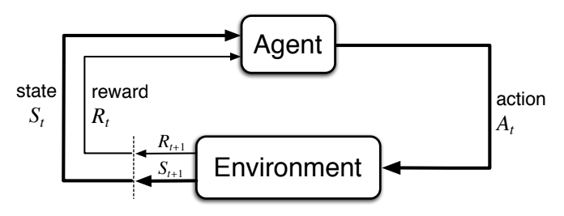
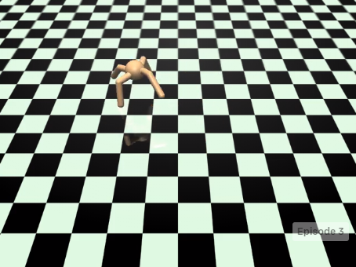
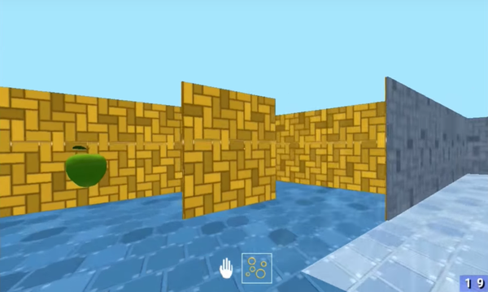
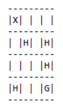

.. Copyright 2018/2019 The RLgraph authors. All Rights Reserved.
   Licensed under the Apache License, Version 2.0 (the "License");
   you may not use this file except in compliance with the License.
   You may obtain a copy of the License at
   http://www.apache.org/licenses/LICENSE-2.0
   Unless required by applicable law or agreed to in writing, software
   distributed under the License is distributed on an "AS IS" BASIS,
   WITHOUT WARRANTIES OR CONDITIONS OF ANY KIND, either express or implied.
   See the License for the specific language governing permissions and
   limitations under the License.
   ============================================================================

.. image:: images/rlcore-logo-full.png
   :scale: 25%
   :alt:

The Environment Classes
=======================

What is an Environment?
-----------------------

The generic reinforcement learning problem can be broken down into the following ever repeating sequence of steps.
This sequence is also often referred to as a Markov Decision Process (MDP). An environment describes a particular
MDP:

- An agent that "lives" in some environment observes the current state of that environment. The state could be
  anything from a simple x/y position tuple of the agent to an image of a camera (that the agent has
  access to) or a line of text from the agent's chat partner (the agent is a chat bot). The nature of this
  state signal - its data type and shape - is called the "state space".

- Based on that state observation, the agent now picks an action. The environment dictates from which space this
  action may be chosen. For example, one could think of a computer game environment, in which an agent has to
  move through a
  2D maze and can pick the actions up, down, left, and right at each time step. This space from which to chose is
  called the "action space". In RLgraph, both state- and action spaces are usually given by the environment.

- The chosen action is now executed on the environment (e.g. the agent decided to move left) and the environment
  changes because of that action. This change is described by the transition function :math:`P(S'|S,A)`, which
  outputs the probability for ending up in next state `S'` given that the agent chose action `A` after having
  observed state `S`.

- Besides producing a next state (`S'`), the environment also emits a reward signal (`R`), which is determined by
  the reward function :math:`R(S'|S,A)`, which describes the expected reward when reaching state `S'` after having
  chosen action `A` in (the previous) state `S`.

   Above: The basic cycle in reinforcement learning.
   (source: `Reinforcement Learning - An Introduction - 2nd Edition <https://https://www.amazon.com/dp/0262039249/>`_)

- We now start this procedure again, using `S'` as our
  new observation. We pick another action, change the environment through that action (transition function `P`),
  observe the next state (`S''`) and receive another reward (:math:`R_{t+1}`), and so on and so forth (see figure above).

- The collected rewards (:math:`R_t`) can be used by the agent for learning to act smarter, in fact the reinforcement
  learning incentive is to pick actions in such a way as to maximize the accumulated reward over some amount of
  time (usually some episode, after which the environment must be reset to some initial state).

RLgraph's Environment Adapters
------------------------------

RLGraph supports many popular environment types and standards and offers a common interface into all these.
The base class is the `Environment` and its most important API-methods are `reset` (to reset the environment) and `step`
(to execute an action).
In the following, we will briefly describe the different supported environment types. If you are interested in
writing your own environments for your own RL research, we will be very happy to receive your pull request.
For more information on our environments, see the
`environment reference documentation <reference/environments/>`_.

OpenAI Gym
++++++++++

The `OpenAI Gym <https://gym.openai.com/envs/>`_ standard is the most widely used type of environment in reinforcement
learning research. It contains the famous set of Atari 2600 games (each game has a RAM state- and a 2D image version),
simple text-rendered grid-worlds, a set of robotics tasks, continuous control tasks (via the MuJoCO physics simulator),
and many others.

   Above: The "Ant-v2" environment, one of the many MuJoCo-simulator tasks of the OpenAI Gym.
   (source: `openAI <https://gym.openai.com/>`_).

RLgraph's OpenAIGymEnv class serves as an adapter between RLgraph code and any of these openAI Gym
environments. For example, in order to have your agent learn how to play Breakout from image pixels, you would create
the environment under RLgraph via:

.. code-block:: python

    from rlgraph.environments import OpenAIGymEnv
    # Create the env.
    breakout_env = OpenAIGymEnv("Breakout-v0", visualize=True)
    # Reset the env.
    breakout_env.reset()
    # Execute 100 random actions in the env.
    for _ in range(100):
        state, reward, is_terminal, info = breakout_env.step(breakout_env.action_space.sample())
        # Reset if terminal state was reached.
        if is_terminal:
            breakout_env.reset()

Deepmind Lab
++++++++++++

`Deepmind Lab <http://https://github.com/deepmind/lab>`_ is Google DeepMind's environment of choice for their advanced
RL research. It's a fully customizable suite of 3D environments (including mazes and other interesting worlds),
which are usually navigated by the agent through a 1st person's perspective.

   Above: The "Nav Maze Arena" environment of the DM Lab.
   (source: `deepmind <https://deepmind.com/blog/open-sourcing-deepmind-lab/>`_).

Different state observation items can be configured as needed at environment construction time, e.g. an image
capturing the 1st person view from inside the
maze or a textual input offering instructions on where to go next (e.g. "blue ladder").
When using more than one state observation items, the Rlgraph state space will be a Dict with the keys describing the
nature of the different observation items (e.g. "RGB_INTERLEAVED" for an RGB image, "INSTR" for the instruction string).

DM Lab itself (and hence also its RLgraph adapter) is somewhat hard to install and only runs on Linux and Mac.
For details, you can take a look at our
`Docker file <https://github.com/rlgraph/rlgraph/blob/master/docker/Dockerfile>`_ to see which steps are required in
order to get it up and running.

Simple Grid Worlds
++++++++++++++++++

Grid worlds are a great way to quickly test the learning capabilities of our agents. They are simple worlds with square
fields on which an agent can move up, down, left or right. There are walls, through which an agent cannot move,
fire, on which a negative reward is collected, holes, into which an agent will fall to collect a negative reward
and end the episode, a starting state, from which the agent starts after a reset, and a goal state, which the agent
has to reach in order to end the episode and to collect a large reward.

RLgraph comes with its own GridWorld environment class that can be customized in its map (dimensions, locations of
walls, etc..), the transition- and the reward function.

   Above: The 4x4 grid world showing the agent's position (X), some holes (H) and the to-be-reached
   goal state (G). Allowed actions are up, down, left and right.

Check out the `reference documentation on the GridWorld and other supported environments here
<reference/environments/>`_.

