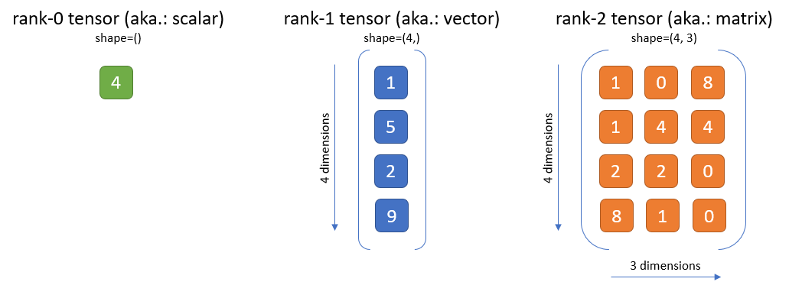
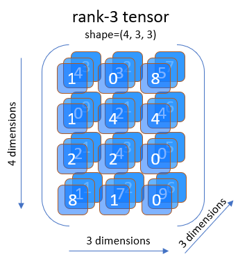
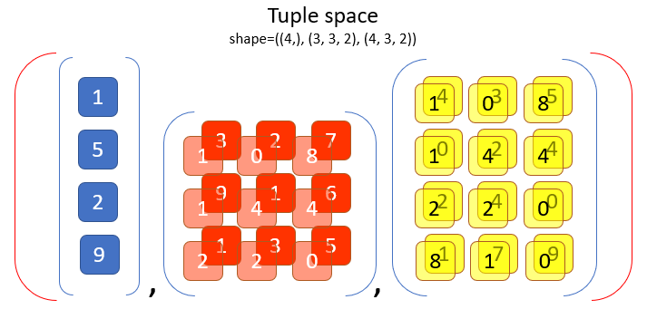
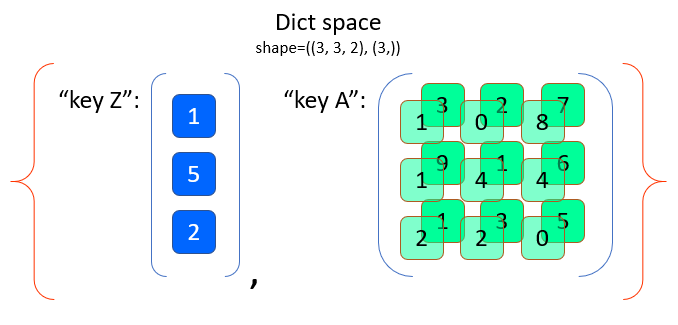

.. Copyright 2018/2019 The RLgraph authors. All Rights Reserved.
   Licensed under the Apache License, Version 2.0 (the "License");
   you may not use this file except in compliance with the License.
   You may obtain a copy of the License at
   http://www.apache.org/licenses/LICENSE-2.0
   Unless required by applicable law or agreed to in writing, software
   distributed under the License is distributed on an "AS IS" BASIS,
   WITHOUT WARRANTIES OR CONDITIONS OF ANY KIND, either express or implied.
   See the License for the specific language governing permissions and
   limitations under the License.
   ============================================================================

.. image:: images/rlcore-logo-full.png
   :scale: 25%
   :alt:

The Space Classes
=================

What is a Space?
----------------

Spaces in RLgraph are used to define the types and shapes of data flowing into, between, and from the different
machine learning components. For example, an environment may output an RGB color image (e.g. 80x80 pixels) at any
time step, which our RL algorithm will use as its only input to determine the next action.
An RGB color image is usually a member of an int-type space with the exact data type being uint8
(meaning the value can range from 0 to 255) and with a shape of [width x height x 3], where the 3 represents the three
color channels: red, green, and blue.
Values of 0 mean no intensity in a color channel, 255 means full intensity.

Difference between Space and Tensor
+++++++++++++++++++++++++++++++++++

Whereas a space defines the constraints in terms of dimensionality and data type of some data,
a tensor is a member (or an instance) of a Space. A tensor (as opposed to a space) holds actual numeric values,
which obey the rules and bounds of the given Space.

   Above: Examples for a rank-0 (scalar), a rank-1 (vector), and a rank-2 (matrix) int-type tensor.

Ranks, Dimensions and Shapes
++++++++++++++++++++++++++++

The rank of an example image tensor is 3, since we have - for each image instance - a 3D cube of numbers defining the
exact look of that image. The 3 ranks stand for the width, height and color depth of the image.
An example rank-3 tensor is shown in the figure below.

   Above: Example for a rank-3 tensor (e.g. an RGB-image).

A space's or a tensor's rank is often confused with it's dimensions. In RLgraph, we
speak of dimensions only as the size of each rank. Compare this to the figure above: The dimensions for each rank are 4
(1st rank), 3 (2nd rank), and 3 (3rd rank). In the tensorflow documentation, you will often find the term nD tensor
for a rank-n tensor, which is a little misleading.

Another often used term for the set of all dimensionality values is the "shape" and it's often provided as a
tuple. The shape of our example image is (80, 80, 3) and this shape tuple is sufficient to determine both a space's
rank (len(shape)) and its dimensions (shape[0], shape[1], and shape[2]).

There are two major types of Spaces: BoxSpaces and ContainerSpaces.
-------------------------------------------------------------------

Box Spaces
++++++++++

A BoxSpace is simply an n-dimensional cube of numbers (or strings), where the numbers must all be of the same data type
("dtype" from here on). RLgraph's dtypes are based on the numpy type system and supported types are np.ints (such as
np.int32 or np.uint8), np.floats (e.g. np.float32), np.bool\_, as well as a box type for textual data, which has the
dtype np.string\_. The rank of a box can be anything from rank-0 (a single scalar value), rank-1 (a vector of
values), rank-2 (a matrix of values), rank-3 (a cube), to any higher dimensional box. All tensors shown in the
figures on top are examples for tensors being instances of some box-space.

Container Spaces
++++++++++++++++

Container Spaces can contain Box Spaces as well as other Container Spaces in an arbitrarily nested fashion. The two
supported container types are Tuple and Dict.

A Tuple is an ordered sequence of other Spaces (similar to a python tuple). For example:
An environment that produces an RGB image and a
text string at each time step could have the space: Tuple(IntBox(80,80,3, np.uint8), TextBox()).

Another example for a tuple space is shown below. Note that explicit numeric values are missing in the figure
as we are showing a space, not an actual tensor of numbers.

   Above: Example Tuple space with 3 box-type child-spaces.
   *Note* that a Tuple can contain other container spaces in a deeply nested fashion. Shown here is only a
   relatively simple Tuple with only box spaces as single elements.

Another way to describe a space containing an image and text is through a keyed Dict space (similar to python dicts),
with the two keys: "image" and "text". For example: Dict({"image": IntBox(80,80,3, np.uint8), "text": TextBox()}).

Containers are fully equivalent to Box Space classes in that they also have shapes and dtypes. However, these are
represented by heterogeneous tuples. Our Image-and-Text Dict space from above, for example, would have a shape of
((80,80,3),()), a rank of (3, 0) and a dtype of (np.uint8, np.string\_).

   Above: Example Dict space with 2 keys, each one holding a box-type child-space.
   Note here that for Dict spaces, the order of the keys are sorted alphabetically before generating shape, rank and
   dtype tuples. In this case: "key A" comes before "key Z". For Tuple spaces, this order is given by
   the sequence of sub-Spaces inside the Tuple. Nested Container Spaces (e.g. a Dict inside another Dict) generate
   equally nested shape, rank and dtype tuples.

Special Ranks of BoxSpaces.
---------------------------

TODO: Describe the generic special ranks once we have them implemented (will replace the current special ranks: batch
and time).

